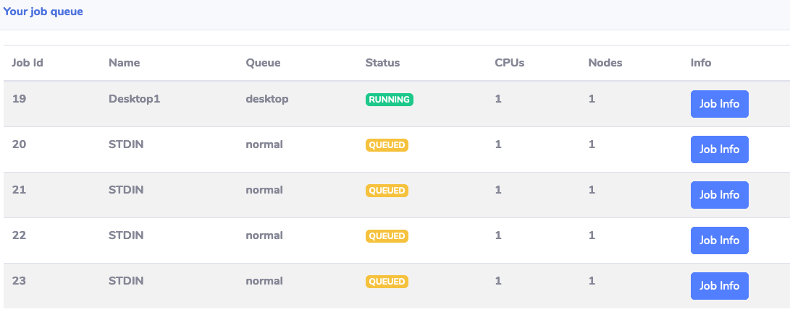

# Lab 4: Submit Batch Jobs

This module provides instructions for running an example batch workload in the computing envronment created the **Deploy environment** module. The example workload is a CPU- and IO-intensive logic simulation that is found in integrated cicuit design workflows.

### Step 1: Submit jobs to the scheduler

Next, you'll submit four jobs into the cluster, each job requesting a specific instance type. Using multiple instance types will help provide more interesting data to look at in the analytics lab.

1. Execute the run_tests.sh script which will submit 20 batch jobs to the queue by typing `./run_tests.sh` then hit enter. You'll observe that the PBS scheduler will report the corresponding job idsfor each of these 20 jobs. 

1. You can examine the run_tests.sh script by typing `cat run_tests.sh` and observe that for each test we're specifying a different instance_type. This will usually depend on the CPU and memory requirements for the corresponding test.

### Step 2: Watch job status

1. As soon as jobs are sent to the queue, SOCA automation scripts will create a new compute instance to execute each job. Run the `qstat` command to view the status of the jobs. You can also view job status in the web UI by clicking on **My Job Queue** in the left side navigation bar.
    

1. You can run the `pbsnodes -aSjL` command to see the EC2 instances that have joined the cluster. Initially, the nodes will be in **state-unknown,down** till they boot-up and join the queue.
    !!! note
       The scheduler is configured to monitor the status of the queues every minute. It typically takes 5-6 minutes to launch a new EC2 instance, boot the operating system, configure it to join the cluster, and have the assigned job to start running. 

### Step 3: Monitor test20 job

1. Monitor the status of test20 job by refreshing the **My Job Queue** page in SOCA portal and look for the **Status** column for the job with test20 under **Name** column.

1. You can also monitor the job status in the terminal by typing `qstat` command.

1. Once the job is in the running state, look inside test20 directory for test.log and novas.fsdb by typing `ls test20/*`. Wait until test20/novas.fsdb is created as you'll need to use it in the next lab.
 
Click **Next** to move to the next lab.
